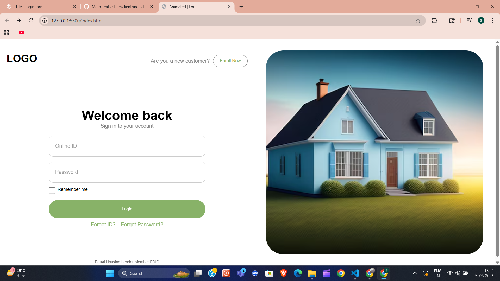

# 🌟 Animated Login Page

A **modern and responsive login page** built using **HTML, CSS, and Vanilla JavaScript**.  
It includes smooth animations, interactive form validation, loading animations, and a responsive layout.  



---

## ✨ Features

- 🎨 **Smooth Animations** – Logo transitions, sliding forms, and fade-in effects.  
- 🔑 **Interactive Login Form** – Floating labels, password visibility toggle, and "Remember Me" option.  
- ⏳ **Loading Animation** – Animated spinner on login button.  
- 🖼 **Responsive Layout** – Works seamlessly across desktop & mobile devices.  
- 📂 **Enroll Dropdown** – Hover-based dropdown with enrollment details.  
- 🔗 **Forgot ID & Password Links** – Redirect to respective pages.  

---

## 🛠️ Tech Stack

- **HTML5** – Semantic markup  
- **CSS3** – Flexbox, animations, transitions, responsive media queries  
- **Vanilla JavaScript (ES6)** – DOM manipulation, event handling, form validation  

---

## 🚀 Getting Started

Follow these steps to run the project locally:

### 1️⃣ Clone the repo
```bash
git clone https://github.com/vishShivansh/Animated-Login-page.git
cd Animated-Login-page

### 2️⃣ Open in Live Server

Run this command to start the project with auto-reload:
```bash
npx live-server